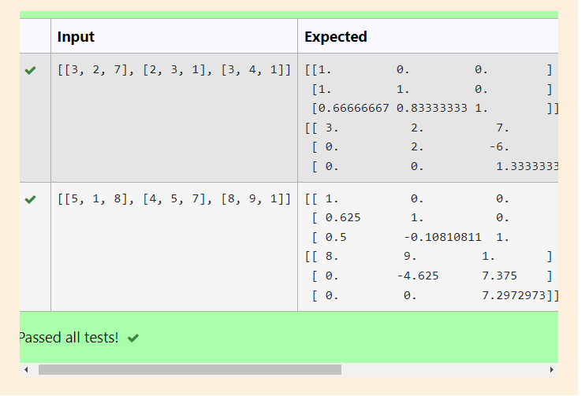
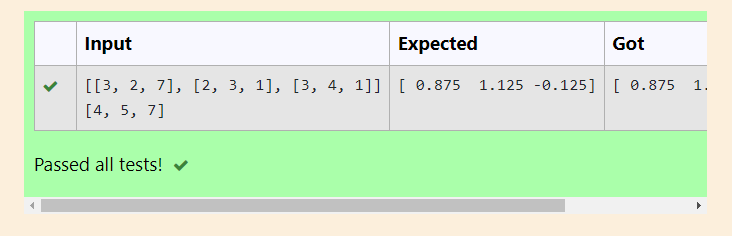

# LU Decomposition without zero on the diagonal

## AIM:
To write a program to find the LU Decomposition of a matrix.

## Equipments Required:
1. Hardware – PCs
2. Anaconda – Python 3.7 Installation / Moodle-Code Runner

## Algorithm
1. Import numpy and scipy from the library.
2. Get input from the user for the matrices .
3. Calculate the LU decomposition.
4. Print the output.

## Program:
```
/*
Program to find the LU Decomposition of a matrix.
Developed by: Sai Darshan G
RegisterNumber: 21003195

# To print L and U matrix
import numpy as np
from scipy.linalg import lu
A= np.array(eval(input()))
P,L,U=lu(A)
print(L)
print(U)


/*
Program to find the solution of linear equations using the LU Decomposition.
# To print X matrix (solution to the equations)
import numpy as np
from scipy.linalg import lu_factor,lu_solve
A=np.array(eval(input()))
B=np.array(eval(input()))
lu,piv=lu_factor(A)
x=lu_solve((lu,piv),B)
print(x)
```

## Output:




## Result:
Thus the program to find the LU Decomposition of a matrix is written and verified using python programming.

